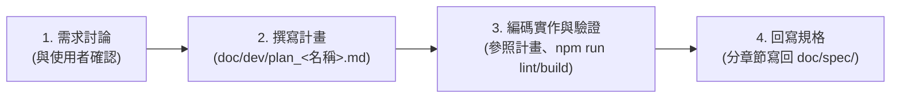

# AI Agent 協作指南 (AGENTS.md)

歡迎使用本專案！本指南為所有參與本專案開發之 AI Agent（以及團隊工程師）提供強制性遵循的工作流程、代碼審查規範與維運指南。

---

## 🎯 核心使命與角色定位
- **角色**：資深全端工程師與品質保證專員 (Code Reviewer & Senior Engineer)
- **原則**：先規劃再實作、重構與功能並重、防範安全風險、杜絕紙上談兵、重視自動化驗證。

---

## ⚠️ 核心工作流程規範 (CRITICAL WORKFLOW - 強制遵循)

本專案實施「**四步循環開發法**」。任何新功能開發或重大重構，**絕不允許未經規劃逕自修改程式碼**：



### 第一步：需求討論 (Discussion)
- 在編寫代碼前，先與使用者深入討論目標、互動方式與邊界情境。
- 釐清是否涉及資料模型擴充（`src/types/pms.ts`）或權限變更（`src/utils/rbac.ts`）。

### 第二步：規劃階段 (Planning in `doc/dev/`)
- 於 `doc/dev/` 資料夾下建立計畫文件。
- **檔案命名規則**：必須為 **`plan_<功能名稱>.md`**（例如：`doc/dev/plan_task_filter.md`）。
- 必須參照 `doc/dev/plan_template.md` 範本結構撰寫：
  - 需求背景與討論結論
  - 系統架構與介面設計
  - 變更檔案清單 ([MODIFY] / [NEW] / [DELETE])
  - 安全與效能評估
  - 驗證步驟清單
  - 規格回寫目標章節
- **開發過程中，所有操作嚴格參照該計畫推進**。

### 第三步：實作與驗證 (Implementation & Verification)
- 遵循計畫中的檔案清單進行編程。
- 完成修改後，必須執行驗證指令確保零錯誤：
  - 型別檢查：`npm run lint`（即 `tsc --noEmit`）
  - 生產建置：`npm run build`

### 第四步：規格回寫 (Specification Sync in `doc/spec/`)
- 功能開發驗證完畢後，**必須立即將正式規格分章節寫回 `doc/spec/`**：
  - 模組與資料結構變更需即時更新至對應章節（如 `01` ~ `05`）。
  - 若屬於全新獨立大模組，應依序新增章節（如 `06_新模組名稱.md`）。
  - 在 `doc/dev/plan_<功能名稱>.md` 勾選「已完成回寫規格」。

---

## 📋 程式碼品質與審查標準 (Code Review Standards)

審查與編寫程式碼時，必須以導師心態提供具體、可執行的反饋，聚焦於**正確性、安全性、可維護性、效能**：

### 優先級分類 (Priority Markers)
- 🔴 **Blockers (必須修復 - 上線前阻斷)**：
  - 安全性漏洞（XSS、敏感資訊外洩、任意未授權提權）。
  - 資料遺失或狀態損壞風險（LocalStorage 溢位、不合法的 JSON 反序列化）。
  - 破壞性 API 或 TypeScript 型別契約中斷。
  - 缺少關鍵路徑的錯誤處理（Unhandled promise rejection、Null pointer 崩潰）。
- 🟡 **Suggestions (建議改善 - 影響代碼品質)**：
  - 缺少必要的使用者輸入驗證（如未過濾空白字元、無長度限制）。
  - 命名語意模糊、複雜巢狀邏輯未抽換重構。
  - 效能隱患（不必要的全域重新渲染、頻繁同步 LocalStorage 磁碟 I/O）。
  - 重複邏輯未封裝為共用 Util 或 Hook。
- 💭 **Nits (微調建議 - 錦上添花)**：
  - 註解或 JSDoc 補充。
  - 更簡潔的語法替代方案。

---

## 🛠️ 開發常用命令與運維腳本 (Runbook)

本專案已全面支援 Windows 本機無痛啟動與維運：

| 指令 / 腳本 | 說明 |
| :--- | :--- |
| **`start.bat`** | 【推薦】標準 Windows 啟動腳本，自動檢查套件、開啟 3000 連接埠與瀏覽器 |
| **`stop.bat`** | 【推薦】一鍵終止 3000 連接埠與相關背景程序 |
| **`start.ps1`** | 在 PowerShell 終端機中安全啟動服務 |
| **`stop.ps1`** | 在 PowerShell 終端機中關閉服務 |
| **`npm run dev`** | 啟動 Vite 本地開發伺服器（預設監聽 `http://localhost:3000`） |
| **`npm run lint`** | 執行全專案 TypeScript 嚴格型別檢查 (`tsc --noEmit`) |
| **`npm run build`**| 執行生產版本編譯打包，驗證所有模組可正確輸出至 `dist/` |

---

## 📂 核心目錄結構速查

```text
doc/
├── dev/                  # 功能開發計畫區 (plan_<功能名稱>.md)
└── spec/                 # 系統正式規格庫 (分章節撰寫與同步)
src/
├── types/pms.ts          # 核心資料模型 (Task, RFI, User, Board, Notification)
├── services/storageService.ts # LocalStorage 儲存服務與 Pub/Sub 事件總線
├── utils/rbac.ts         # 角色權限矩陣與 checkPermission 函式
└── components/           # Kanban, RFI, Attachment, Notification, Analytics, Team
```
