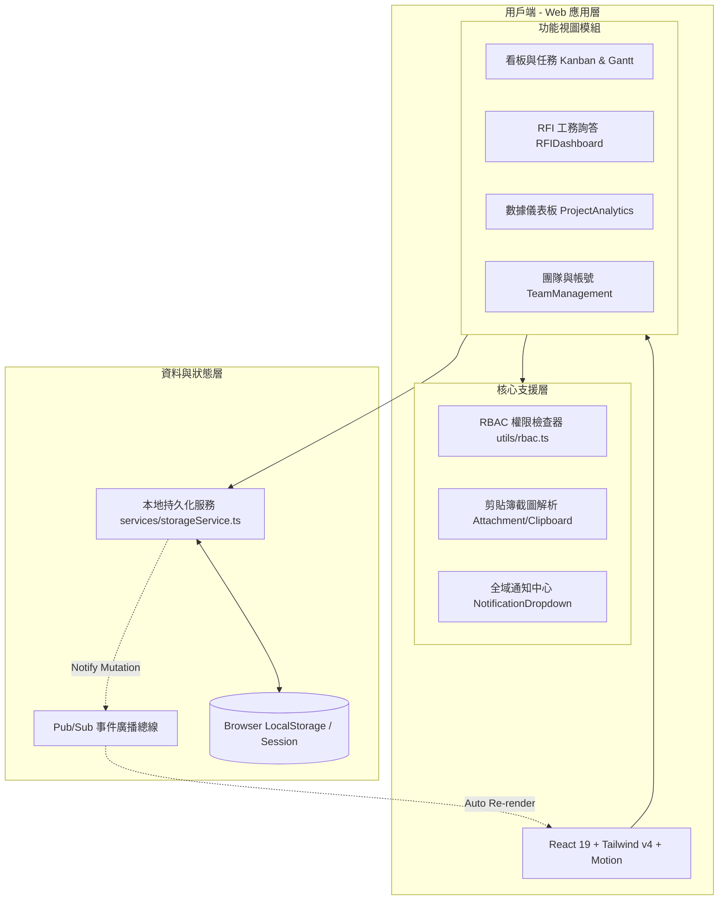

# 系統架構與設計指南 (System Design Document)

本文件定義「企業級專案管理系統 (Enterprise PMS & RFI)」之軟體架構、設計理念、資料流向、技術選型與文檔治理規範。

---

## 1. 系統設計目標與原則 (Design Principles)

1. **純本地敏捷運作 (Local-First Architecture)**：
   - 脫離特定雲端綁定，支援 Windows / macOS / Linux 離線本機啟動。
   - 資料透過 `storageService` 於瀏覽器 LocalStorage 持久化，兼具極速讀寫與響應式更新。
2. **工程專案實務導向 (Real-World Construction & Engineering Focus)**：
   - 結合看板在製品限制 (WIP Limit) 防止多工堆積。
   - 內建嚴謹的 RFI（工程工務詢答澄清單）審查狀態機與不可竄改之審計稽核日誌 (Audit Log)。
   - 專門針對圖面附件與螢幕截圖設計直接貼上 (Ctrl+V) 與燈箱檢視。
3. **細粒度角色權限管理 (Granular RBAC)**：
   - 嚴格界定系統管理員、專案經理、現場工程師與外部審查員/業主之操作權限，UI 動態防呆與遮蔽。
4. **極致視覺與互動體驗 (Premium Aesthetics & Modern UI)**：
   - 全面支援深色/淺色模式切換。
   - 使用 Tailwind CSS v4 與 Motion 動畫庫打造細膩的微互動與卡片拖曳體驗。

---

## 2. 系統架構總覽 (System Architecture)



---

## 3. 技術棧選型與規範 (Technology Stack)

| 維度 | 技術 | 版本 | 選型理由 |
| :--- | :--- | :--- | :--- |
| **核心框架** | React | 19.0.1 | 現代化組件模型、高效虛擬 DOM 與並發排程支援 |
| **程式語言** | TypeScript | 5.8.2 | 嚴格型別定義，降低執行時期錯誤，便於大型重構 |
| **建置工具** | Vite | 6.2.3 | 秒級 HMR 熱更新，原生 ESM 開發伺服器與快速 Rollup 打包 |
| **樣式引擎** | Tailwind CSS | 4.1.14 | 採用新世代 @tailwindcss/vite，零 CSS 臃腫、原生 CSS 變數支援 |
| **動畫庫** | Motion | 12.23.24 | 提供流暢的彈簧物理動畫、模態窗進退場微互動 |
| **圖標庫** | Lucide React | 0.546.0 | 簡約俐落、語意清晰之向量圖標庫 |

---

## 4. 模組職責與組件架構 (Component Architecture)

```text
src/
├── App.tsx                    # 全域佈局、專案切換、角色切換、深色模式切換
├── types/pms.ts               # 資料合約與 TypeScript 型別單一真理來源
├── services/storageService.ts # LocalStorage CRUD 與發布訂閱 (Pub/Sub)
├── utils/rbac.ts              # 權限判定與角色描述矩陣
└── components/
    ├── Kanban/                # 看板模組
    │   ├── KanbanBoard.tsx    # 看板主視圖 (欄位排列、WIP 計算、拖曳上下文)
    │   ├── TaskCard.tsx       # 任務卡片展示 (標籤、工時、到期、責任人頭像)
    │   ├── TaskModal.tsx      # 卡片詳情 (編輯、指派、留言、附件)
    │   └── GanttChart.tsx     # 甘特圖時間軸進度視圖
    ├── RFI/                   # 工務詢答模組
    │   ├── RFIDashboard.tsx   # RFI 總覽清單、狀態篩選、工期與成本統計
    │   ├── CreateRFIModal.tsx # 新增 RFI 提報表單
    │   └── RFIDetailModal.tsx # 審查回覆、官方答覆填寫、強制結案、審計稽核日誌
    ├── Attachment/            # 附件處理模組
    │   ├── ClipboardUploadHelper.tsx # 剪貼簿截圖自動捕捉與 Base64 轉換
    │   └── LightboxModal.tsx         # 圖片全螢幕檢視與放大燈箱
    ├── Notification/          # 通知模組
    │   └── NotificationDropdown.tsx  # WIP 告警、RFI 狀態通知清單
    ├── Analytics/             # 數據統計模組
    │   └── ProjectAnalytics.tsx      # 看板分佈圖表、RFI 時效與工期累計圖表
    └── Team/                  # 團隊模組
        └── TeamManagement.tsx        # 使用者清單、角色權限展示與變更
```

---

## 5. 資料流與狀態管理架構 (Data Flow)

為保持極簡高效，本專案不引入 Redux 或 MobX 等重型狀態庫，而是採用 **LocalStorage + Pub/Sub 模式**：
1. **單一資料持久層**：`storageService` 負責所有資料的取得、新增、更新與刪除。
2. **事件推播與自動響應**：
   - 當任何組件呼叫寫入操作（如更新任務、變更 RFI 狀態），`storageService` 自動觸發內部監聽器清單。
   - 主應用 (`App.tsx`) 與各視圖註冊訂閱 (`subscribe`)，資料異動時自動取得最新資料並引發 React 響應式重新渲染。
3. **無縫本地演示**：初次載入若無資料，自動注入 `src/mock/initialData.ts` 之範本專案，立即可用。

---

## 6. 安全性與 RBAC 控制機制 (Security & Permissions)

系統實施嚴格的前端權限邊界：
- 角色清單：`SUPER_ADMIN`（系統管理員）、`PROJECT_MANAGER`（專案經理）、`MEMBER`（團隊成員）、`REVIEWER_CLIENT`（外部審查員/業主）。
- 所有核心操作（看板欄位調整、任務指派、RFI 官方答覆、RFI 結案）均經過 `checkPermission(role, action)` 驗證。
- 敏感動作（如 RFI 狀態流轉）嚴格保留 `RFIAuditLog`，包含異動者姓名、角色、動作與時間戳記。

---

## 7. 文檔治理與開發流程串接 (Documentation Governance)

為防止系統規格脫節或未經思考隨意修改，專案導入規範化文檔治理體系：

1. **開發前**：
   - 充分討論後，在 `doc/dev/` 建立 **`plan_<功能名稱>.md`**（參照 `doc/dev/plan_template.md`）。
   - 載明架構設計、變更檔案與驗證清單，並作為開發時的唯一依據。
2. **開發後**：
   - 功能完成並通過測試後，必須將最新規格「分章節」寫回 **`doc/spec/`**：
     - `00_系統規格總覽與架構導引.md`
     - `01_核心架構與RBAC權限體系.md`
     - `02_看板與任務管理系統.md`
     - `03_RFI工務詢答管理系統.md`
     - `04_附件與截圖上傳系統.md`
     - `05_即時通知與數據分析系統.md`
