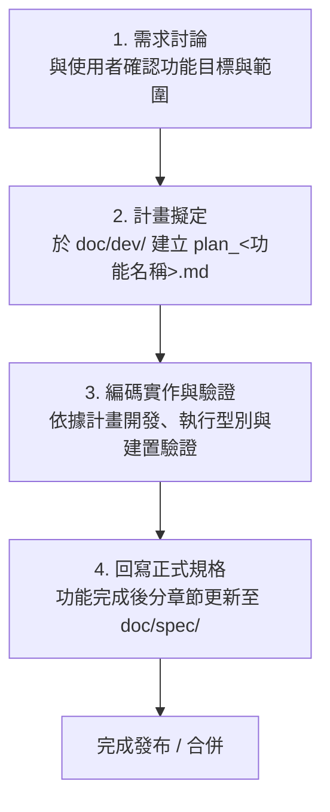

# 專案文檔庫 (Documentation Hub)

本目錄為「企業級專案管理系統 (Enterprise PMS & RFI)」之核心技術規格與開發管理庫。

---

## 📁 目錄結構說明

```text
doc/
├── dev/                     # 功能開發計畫區 (開發前討論、計畫撰寫、開發依據)
│   ├── README.md            # dev 資料夾使用規範與命名規則
│   ├── plan_template.md     # 新功能開發計畫標準範本
│   └── plan_<功能名稱>.md   # 各項功能的具體開發計畫 (如: plan_task_filtering.md)
└── spec/                    # 系統正式規格書 (分章節撰寫與維護)
    ├── README.md            # spec 資料夾維護規範
    ├── 00_系統規格總覽與架構導引.md
    ├── 01_核心架構與RBAC權限體系.md
    ├── 02_看板與任務管理系統.md
    ├── 03_RFI工務詢答管理系統.md
    ├── 04_附件與截圖上傳系統.md
    └── 05_即時通知與數據分析系統.md
```

---

## 🔄 開發工作流程 (Standard Operating Procedure)

為了保證代碼品質與規格文件的嚴謹性，所有開發人員與 AI Agent 請務必嚴格遵循以下「四步循環」工作流：



### 1. 討論階段 (Discussion)
- 在動工編寫任何程式碼前，先與團隊或使用者充分溝通。
- 釐清業務邏輯、互動流程、技術可行性與權限邊界。

### 2. 計畫階段 (Planning in `doc/dev/`)
- 複製 `doc/dev/plan_template.md`。
- 於 `doc/dev/` 下建立檔案，命名格式必須為：**`plan_<功能名稱>.md`**（例如 `plan_gantt_zoom.md`）。
- 完整填寫背景、技術方案、檔案變更清單、測試計畫與規格回寫預計章節。
- 開發全程**嚴格參照此計畫**進行。

### 3. 實作與驗證 (Implementation & Verification)
- 參照對應的 `plan_<功能名稱>.md` 推進實作。
- 實作完成後執行驗證：
  - 型別檢查：`npm run lint` (`tsc --noEmit`)
  - 建置測試：`npm run build`

### 4. 規格回寫階段 (Spec Synchronization in `doc/spec/`)
- 功能開發與驗證完成後，**必須將最新功能規格寫回 `doc/spec/`**。
- `spec` 必須**分章節撰寫**（依據模組分類至 `01` ~ `05` 或新增獨立章節）。
- 確保規格庫與最新程式碼隨時保持 100% 同步。
