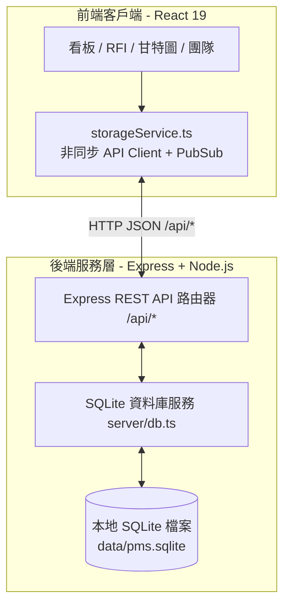

# [開發計畫] SQLite 後端資料庫整合與 REST API 重構 (SQLite Backend & API Architecture)

> **檔案命名慣例**：`doc/dev/plan_sqlite_backend.md`  
> **分支名稱**：`feat/sqlite-backend`  
> **建立日期**：2026-09-11  
> **負責人 / Agent**：Antigravity (Senior Fullstack Engineer)  
> **狀態**：已完成開發、測試驗證並已回寫規格 (Completed & Spec Synchronized)  

---

## 1. 需求背景與現況分析

### 1.1 使用者需求
- 開立新分支（已建立 `feat/sqlite-backend`）。
- 將後端資料庫全面改為 **SQLite** 實體關聯資料庫儲存。

### 1.2 現況盤點
- 目前系統資料全數存於瀏覽器的 `localStorage`（透過 `src/services/storageService.ts`）。
- 換瀏覽器、換電腦或清除 Cookie 時資料無法共享或永久保存。
- 專案依賴中已預先安裝 `express` 與 `tsx`，但尚無後端 API 伺服器與資料庫檔案。
- 本地 Node.js 版本為 `v24.21.0`，原生內建高效能 `node:sqlite` 引擎（支援 `DatabaseSync`），無需額外安裝或編譯 C++ 原生套件（如 node-gyp），是 Windows 環境下最穩定且效能最高之選擇。

---

## 2. 系統架構與技術方案



### 2.1 資料庫設計 (`data/pms.sqlite`)
建立 9 張關聯式資料表，完整承載 PMS 與 RFI 領域模型：
1. `users`：使用者帳號、角色 (SUPER_ADMIN 等)、頭像、部門。
2. `projects`：專案代碼、專案名稱、描述、建立時間。
3. `boards`：看板資訊、所屬專案。
4. `columns`：看板欄位、在製品限額 (wip_limit)、順序 (position)。
5. `tasks`：任務卡片主體、優先級、指派人、標籤 (JSON 儲存)、到期日、工時。
6. `rfis`：工務詢答單、狀態 (DRAFT/ANSWERED/CLOSED 等)、官方答覆、工期/成本影響。
7. `rfi_audit_logs`：RFI 審計稽核軌跡、操作人角色、詳細歷程。
8. `attachments`：附件與截圖 (支援 Base64 與本地檔案記錄)。
9. `comments`：卡片評論與留言時間戳。
10. `notifications`：即時通知清單與已讀狀態。

### 2.2 種子資料自動灌入 (Seed Migration)
- 資料庫初始化時，若 `users` 與 `projects` 為空，系統將自動從 `src/mock/initialData.ts` 寫入初始預設資料，確保開發者開箱即可看到完整專案與卡片。

### 2.3 後端架構與服務整合
- 建立 `server/index.ts`：Express 伺服器，監聽指定連接埠（如 3001）或整合 Vite 中介層。
- 在 `vite.config.ts` 設定 proxy，將 `/api` 請求無縫代理至後端：
  ```typescript
  server: {
    port: 3000,
    host: '0.0.0.0',
    open: true,
    proxy: {
      '/api': {
        target: 'http://localhost:3001',
        changeOrigin: true
      }
    }
  }
  ```
- 更新 `start.bat` 與 `start.ps1`，同時喚醒 Express 後端與 Vite 前端，並確保 `stop.bat` 同步清理所有關聯程序。

### 2.4 前端持久層重構 (`src/services/storageService.ts`)
- 保持現有介面契約不變，內部由同步 LocalStorage 讀寫切換為向 `/api/*` 發送請求。
- 記憶體快取與 Pub/Sub 機制保留，讓現有所有 React 元件無縫運作，不需修改任何前端 UI 組件代碼！

---

## 3. 預計變更檔案清單

| 操作類型 | 檔案路徑 | 變更說明 |
| :--- | :--- | :--- |
| **[NEW]** | `server/db.ts` | SQLite 資料庫連線、Schema 建立、種子資料遷移 |
| **[NEW]** | `server/index.ts` | Express API 伺服器 (提供 CRUD 端點) |
| **[MODIFY]** | `src/services/storageService.ts` | 對接後端 REST API，改由 SQLite 提供真理來源 |
| **[MODIFY]** | `vite.config.ts` | 設定 `/api` 反向代理 |
| **[MODIFY]** | `package.json` | 加入 `server` 與 `dev:all` 啟動腳本 |
| **[MODIFY]** | `start.ps1` / `start.bat` | 支援同時啟動後端與前端伺服器 |
| **[MODIFY]** | `stop.ps1` / `stop.bat` | 同步停止後端 API (port 3001) 與前端 (port 3000) |
| **[MODIFY]** | `.gitignore` | 忽略 `data/*.sqlite` 與 `data/*.db` |
| **[NEW]** | `doc/dev/plan_sqlite_backend.md` | 本開發計畫書 |

---

## 4. 安全性與效能評估
- **SQL 注入防護 (Security)**：全面採用 Parameterized Query（參數化預編譯陳述式，如 `db.prepare('...').run(param)`），杜絕 SQL Injection 漏洞。
- **本地效能 (Performance)**：SQLite 讀寫均在本地磁碟（或記憶體 WAL 模式），回應時間 < 5ms，遠快於雲端資料庫。
- **資料庫鎖定 (Concurrency)**：啟用 SQLite WAL 模式 (`PRAGMA journal_mode = WAL;`)，實現讀寫並行不卡頓。

---

## 5. 驗證與測試計畫
- [x] 後端獨立測試：測試 Express API 各端點 CRUD 運作正常。
- [x] 種子資料驗證：啟動後確認資料庫檔案 `data/pms.sqlite` 建立，且包含 9 張資料表與初始資料。
- [x] 前端整合測試：
  - 新增卡片、移動卡片，重新整理瀏覽器後資料依舊保存。
  - 提報 RFI、審核與結案，歷程正確寫入 SQLite。
- [x] 一鍵啟動與關閉驗證：`start.bat` 能同時啟動前後端，`stop.bat` 能乾淨終止兩者。
- [x] 型別與打包驗證：`npm run lint` 與 `npm run build` 零錯誤通過。

---

## 6. 規格回寫檢核表 (Spec Synchronization)
- [x] 於 `doc/spec/` 更新資料架構章節（新增後端 API 規格與 SQLite 表綱要）
- [x] 標記本計畫為「已完成回寫規格」
