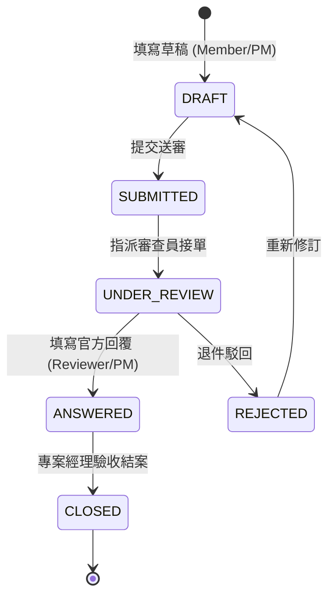

# 第四章：RFI 工務詢答管理系統

## 4.1 RFI 業務定位
RFI（Request For Information，工務資訊澄清詢答單）為工程與專業專案管理核心流程。用於解決圖面衝突、法規疑義、材料替代或設計變更，並嚴格管控因此衍生之**工期**與**成本**影響。

---

## 4.2 RFI 資料模型

```typescript
export type RFIStatus =
  | 'DRAFT'           // 草稿：尚未正式提交
  | 'SUBMITTED'       // 已提交：等待分派審查員
  | 'UNDER_REVIEW'    // 審查中：審查員/業主研議中
  | 'ANSWERED'        // 已回覆：官方答覆完成
  | 'CLOSED'          // 已結案：經理審核確認結案
  | 'REJECTED';       // 已駁回：退件需重新提報

export interface RFI {
  id: string;
  project_id: string;
  rfi_number: string;              // 系統自編號 (例: RFI-PJ01-2026-0042)
  subject: string;                 // 主旨
  question: string;                // 詢問問題詳細內文
  suggested_solution: string;      // 承包方建議解決方案
  official_reply: string | null;   // 官方審查正式回覆
  status: RFIStatus;
  priority: Priority;
  reference_spec_no: string;       // 關聯圖面或規範編號
  cost_impact: boolean;            // 是否衍生額外費用
  schedule_impact: boolean;        // 是否影響工期
  schedule_days_impact: number;    // 預計影響工作天數
  author_id: string;
  assigned_reviewer_id: string | null;
  due_date: string | null;
  answered_at: string | null;
  answered_by: string | null;
  closed_at: string | null;
  closed_by: string | null;
  created_at: string;
}
```

---

## 4.3 狀態機流轉規則 (State Machine)



---

## 4.4 審計稽核軌跡 (RFIAuditLog)
每次 RFI 狀態躍遷或關鍵回覆產生時，系統強制寫入不可竄改的審計日誌：
```typescript
export interface RFIAuditLog {
  id: string;
  rfi_id: string;
  action: string;
  user_id: string;
  user_name: string;
  user_role: UserRole;
  details: string;
  timestamp: string;
}
```
確保工程法律責任追溯與合約爭議排解依據。
